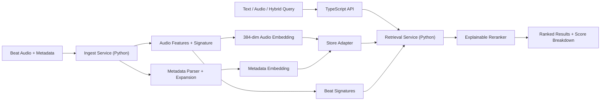

# BeatFinder Hybrid Retrieval v1

BeatFinder v1 is a runnable hybrid beat-retrieval prototype focused on finding the exact beat behind a song or clip. It combines:

- audio feature retrieval
- metadata phrase retrieval
- explainable score fusion
- a thin TypeScript HTTP API
- Supabase-ready primary, mirror, and local storage modes

This is not a generic text-only RAG app. The engine treats beat retrieval as a fusion problem across audio similarity, near-exact signatures, and rich metadata normalization.

## What It Does

- Ingests beat audio plus metadata.
- Accepts audio input by JSON file path, base64, or multipart upload.
- Extracts audio features, a 384-dim audio embedding, and a perceptual signature.
- Normalizes metadata like:
  - `#phillytypebeat`
  - `#newyorkdrilltypebeat`
  - `sza x summer walker`
  - `era jay x bani`
  - `milwaukee x detroit type beat`
- Supports text, audio, and hybrid search.
- Returns ranked candidates with score breakdowns instead of a single opaque score.

## Verified Behavior

The local verified path currently confirms all of the following:

- fixture ingest succeeds for 7 controlled beats
- exact audio query ranks the same beat first
- short clip query ranks the source beat first
- text query returns the right family of beats
- hybrid query promotes the exact audio match above the text-only ranking

Latest verified local results in this environment:

- exact audio top result: `SZA x Summer Walker Type Beat - Late Nights`
- clip top result: `SZA x Summer Walker Type Beat - Late Nights`
- text top result: `SZA x Summer Walker Type Beat - Afterglow`
- hybrid top result: `SZA x Summer Walker Type Beat - Late Nights`

## Stack

- Python 3.12 for ingestion, audio processing, retrieval, reranking, fixtures, and tests
- Node 24 TypeScript server for the thin API
- Supabase SQL migrations and Edge Function scaffolding for Postgres, pgvector, Storage, and auth-ready deployment
- Hugging Face integration hook for metadata embeddings
- Gemma-family reasoning interface with deterministic local fallback
- GitHub Actions for CI

## Architecture



More detail lives in [docs/architecture.md](/Users/traytray/Downloads/BeatFinder_galaxy_%202/docs/architecture.md).

## Storage Modes

- `local`: file-backed JSON state for fully offline verification
- `mirror`: local-first state plus Supabase mirror writes
- `primary`: Supabase-backed persistence and candidate retrieval with local scratch space for audio processing

Set the mode with `BEATFINDER_SUPABASE_MODE=local|mirror|primary`.

## Repo Layout

```text
backend/
  api/                 TypeScript HTTP server + multipart parsing
  discovery/           producer channel discovery + YouTube beat metadata backfill
  ingest/              beat ingestion service
  retrieval/           text/audio/hybrid candidate generation
  rerank/              explainable score fusion
  storage/             local, mirror, and Supabase-primary adapters
  tests/               unit + integration + API smoke tests
  workers/             CLI entry point
models/
  audio/               WAV loading, features, signatures
  embedding/           local + Hugging Face embedding providers
  metadata/            normalization, parsing, Gemma-facing interface
supabase/
  migrations/          pgvector-ready schema
  functions/           thin edge health function + shared CORS
scripts/
  dev/                 local start + lint
  discovery/           local producer seed loading
  ingest/              fixture loading
  eval/                evaluation harness
docs/
  architecture.md
  ci.md
  ios-api-integration.md
  local-setup.md
  producer-discovery.md
  production-readiness.md
  test-plan.md
  api.md
worker/
  README.md            legacy worker notes, not authoritative for v1
```

## Local Run

1. Configure the local verified runtime.

```bash
cp .env.example .env
export BEATFINDER_PYTHON_BIN=python3
export BEATFINDER_NODE_BIN=node
export BEATFINDER_STATE_DIR=.beatfinder_state
export BEATFINDER_SUPABASE_MODE=local
```

2. Seed fixture beats and local producer discovery channels.

```bash
$BEATFINDER_PYTHON_BIN scripts/ingest/load_fixtures.py
$BEATFINDER_PYTHON_BIN scripts/discovery/load_producer_seeds.py
$BEATFINDER_PYTHON_BIN scripts/discovery/load_mock_youtube_backfill.py
```

3. Run the local API.

```bash
scripts/dev/start_local.sh
```

4. Query the API.

```bash
curl -s http://127.0.0.1:8787/health
curl -s -X POST http://127.0.0.1:8787/search/text \
  -H 'Content-Type: application/json' \
  -d '{"query":"sza x summer walker type beat","top_n":5}'
```

See [docs/api.md](/Users/traytray/Downloads/BeatFinder_galaxy_%202/docs/api.md) for JSON and multipart request shapes.

## Run Tests

```bash
$BEATFINDER_PYTHON_BIN scripts/dev/lint.py
$BEATFINDER_PYTHON_BIN -m unittest discover -s backend/tests -p 'test_*.py' -v
$BEATFINDER_PYTHON_BIN scripts/eval/run_eval.py
```

Or run the local verification flow:

```bash
scripts/dev/verify_local.sh
```

## OpenClaw

OpenClaw is intentionally not in the hot path.

What it should do in this repo:

- trigger fixture or admin ingest jobs
- run evals
- inspect uncertain matches
- kick off re-embedding or maintenance commands

What it should not do:

- serve end-user search traffic
- decide the retrieval result directly
- become a dependency for app startup

The current repo ships the retrieval engine and CLI entry points that an OpenClaw admin workflow can wrap later. See [docs/openclaw-ops.md](/Users/traytray/Downloads/BeatFinder_galaxy_%202/docs/openclaw-ops.md).

## Gemma

Gemma is used here as an interface boundary for:

- metadata normalization assistance
- phrase expansion
- rerank explanation

The preferred remote target is a Gemma 3 family model. Because remote model access is blocked in this environment, the verified local build uses the deterministic fallback in `models/metadata/gemma_adapter.py`.

## Hugging Face

The verified local build uses a deterministic metadata embedder so the system can run offline. A Hugging Face HTTP embedding adapter is already wired in `models/embedding/providers.py` and can be activated by setting:

- `HF_API_TOKEN`
- `BEATFINDER_HF_TEXT_ENDPOINT`
- `BEATFINDER_HF_TEXT_MODEL`
- `BEATFINDER_TEXT_EMBEDDING_DIM=384`

## Known Limitations

- The verified local build still uses deterministic local embeddings instead of live Hugging Face embeddings because outbound model access was unavailable here.
- The Gemma layer supports a remote HTTP hook, but the validated path in this environment remains the deterministic fallback.
- Supabase primary mode and its live integration tests are implemented, but they were not executed here because no live project credentials were available.
- The fixture dataset uses synthesized WAV audio. It is useful for repeatable retrieval testing, but it is not a substitute for production evaluation on licensed real beat audio.
- The legacy `worker/` directory is documented for reference only and is not the authoritative retrieval path for this v1.

See [KNOWN_ISSUES.md](/Users/traytray/Downloads/BeatFinder_galaxy_%202/KNOWN_ISSUES.md).
See [docs/production-readiness.md](/Users/traytray/Downloads/BeatFinder_galaxy_%202/docs/production-readiness.md) for the remaining work before real users.

## Official References Used

- [Supabase AI & Vectors](https://supabase.com/docs/guides/ai)
- [Supabase pgvector](https://supabase.com/docs/guides/database/extensions/pgvector)
- [Supabase Vector Indexes](https://supabase.com/docs/guides/ai/vector-indexes)
- [Supabase Edge Functions](https://supabase.com/docs/guides/functions)
- [Hugging Face Sentence Transformers](https://huggingface.co/docs/hub/en/sentence-transformers)
- [Hugging Face Wav2Vec2 docs](https://huggingface.co/docs/transformers/en/model_doc/wav2vec2)
- [Gemma overview](https://ai.google.dev/gemma/docs)
- [OpenClaw getting started](https://docs.openclaw.ai/start/getting-started)
- [GitHub Actions overview](https://docs.github.com/en/actions/get-started/understanding-github-actions)
